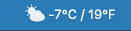
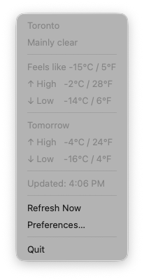

# DualTemp

A macOS menu bar app that displays the current temperature in both Celsius and Fahrenheit.




## Features

- Current temperature displayed in the menu bar (C/F or F/C)
- Feels-like temperature, daily high/low, and weather condition in the dropdown
- Optional tomorrow's forecast (high/low)
- Auto-detect location or set a city manually
- Configurable refresh interval (5, 10, or 30 minutes)
- Choice of 4 menu bar icon styles with visual previews
- Offline fallback using cached data
- Launch at login

## Install

Download the latest `.dmg` from [Releases](https://github.com/lowvisiondave/dual-temp/releases), open it, and drag DualTemp to Applications.

## Development

Requires Node.js 18+.

```bash
npm install
npm run generate-icons   # regenerate menu bar and app icons
npm start                # run in development mode
```

## Build

```bash
npm run dist             # produces a .dmg in dist/
```

## Data Sources

- Weather: [Open-Meteo](https://open-meteo.com/) (free, no API key)
- Geolocation: [ip-api.com](http://ip-api.com/)

## License

MIT
